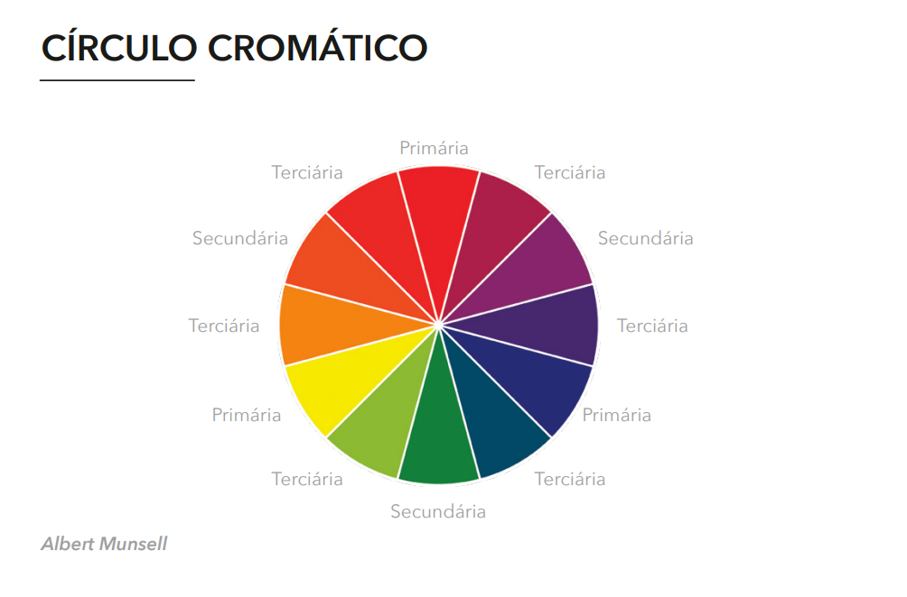
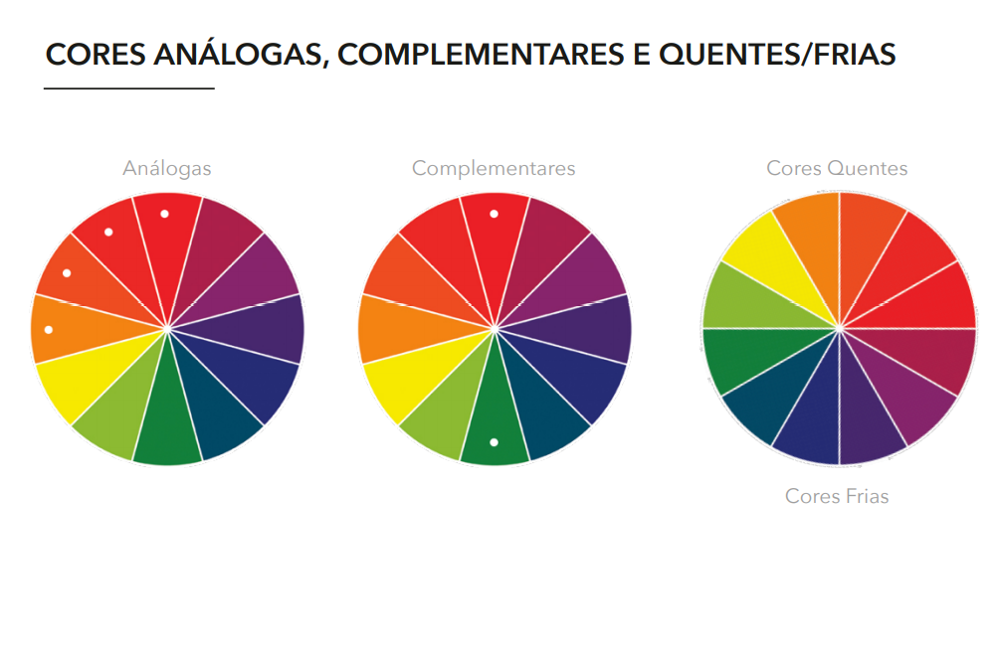
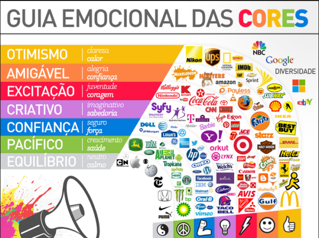

Cores
    - "Há poucos estímulos visuais tão potentes quanto as cores, elas são uma ferramenta de comunicação extremamente útil." Timothy Samara

Círculo cromático
    

Cores análogas, complementares e quentes e frias
    

Significado de cores porém não está escrito na pedra, algumas coisas podem mudar de cultura para cultura
    
