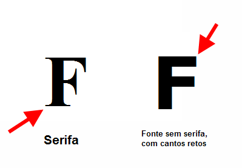

#### Tipografia: 
    - “É a arte e processo de criação de um 
texto. O objetivo principal é dar ordem 
estrutural e forma a comunicação.” Wikipédia

#### Variáveis tipográficas:
    - Tamanho do tipo
        EX: 14px, 16px ou 18px.
    
    - Altura da linha
        EX: 1,5 * Tamanho do texto.
            1,5 * 14px= 21px
    - Largura do texto
        Máximo de 10/14 palavras por linha.

    Obs: Indicações feitas para corpo de texto utilizando tipografias como Helvetica e Arial.

#### Escalas tipográficas: 
    - Utilize no máximo 6 tamanhos
        Utilizar mais de 6 tamanhos diferentes de texto pode criar um ruído visual.
    - Escolha uma escala harmônica
        EX: 11px, 14px, 18px, 24px, 36px e 48px.
    - Contraste é rei
        Nunca utilize tamanho próximos, como 14px e 15px.

#### Pareando tipos: 
    - Contraste é rei
        Nunca use tipográfias parecidas como Helveltica e Arial para criar uma composição.
    - Use no máximo 2 tipos
    - Escolha tipos complementares
        Tipografias serifadas para o título e sem serifas para o corpo de texto podem ser uma boa combinação.

#### Alinhamento: 
    - À esquerda
        É o padrão da web, usafo 80% das vezes
    - Centralizado
        Bom para títulos, subtítulos ou pequenos blocos de texto.
    - Justificado
        Pouco utilizado na web, pois ainda não existem meios fáceis que permitem a hifemização do texto. Quase sempre gera caminhos de rato na web.

#### Elementos Hierárquicos:
    - Negrito
        Utilizado para destacar palavras importantes
    - Itálico
        Utilizado para estilizar citações, títulos de livros/filmes e outros elementos
    - Sublinhado
        Geralmente utilizado para destacar palavras que possuem link para outra página

#### Caixa: 
    - Caixa alta
        Utilizado para títulos e subtítulos.
        Nunca para textos.
    - Caixa baixa
        Utilizado para textos, é comum as frases estarem capitalizadas.

#### Traking e kerning:
    - Tracking é a distância entre todas as letras
    - Kerning é a distância entre duas letras

#### Fontes com serifa e sem serifa

#### Fontes góticas

#### Fontes Script

